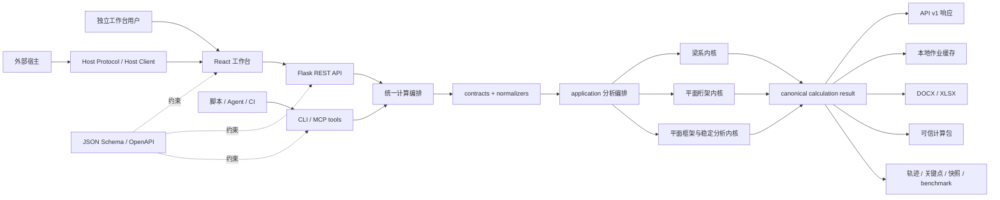
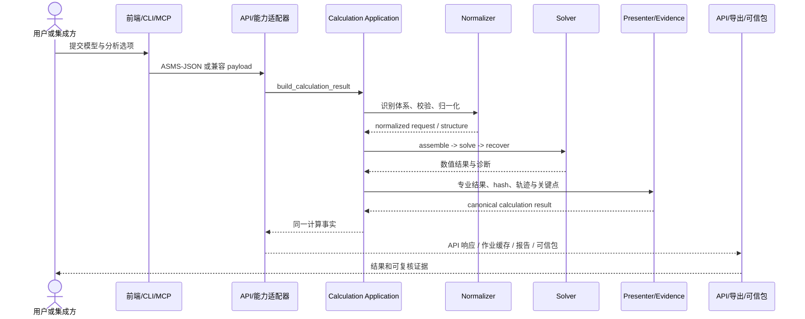

# ArchSight Solver 系统架构导读与问题剖析

本文面向第一次阅读 ArchSight Solver 源码的开发者、结构工程师和技术负责人，说明系统边界、主要模块、核心数据流、验证体系及当前架构风险。

本文描述的是**公开仓库内可复现的架构**，不承担版本发布证明、生产部署记录或商业方案说明。具体发布状态以 [CHANGELOG](../CHANGELOG.md) 和对应版本验收文档为准；生产环境、客户数据、私有平台及本地忽略目录不属于本文范围。

## 1. 一句话理解系统

ArchSight Solver 是一个以确定性结构力学求解为核心、以 ASMS-JSON 和 canonical calculation result 为契约、同时向 Web、REST API、CLI、MCP、计算书和可信计算包提供能力的本地优先开源工作台。

它不是“前端调用几个计算接口”的普通 Web 应用。更准确的理解是：

> 三类结构分析内核提供计算事实；应用层负责组织工况、组合、稳定分析和证据；接口与前端只是这些事实的不同使用入口。

## 2. 公开能力与责任边界

### 2.1 仓库内负责什么

- 梁系、二维平面桁架和二维平面框架的确定性结构分析。
- 模型归一化、单位换算、自由度组织、矩阵装配、求解和结果恢复。
- 框架的一阶线性结果，以及边界明确的二维弹性几何非线性和线性特征屈曲分析。
- ASMS-JSON、REST API、CLI、MCP、`.slv` 工程文件和 Host Protocol 等公开契约。
- 结构图、内力图、结果摘要、DOCX / XLSX 计算书和可信计算包。
- 公开 benchmark、独立刚度法基线、回归测试和可复算证据。

### 2.2 仓库内不负责什么

- 登录、组织、订阅、云端项目、跨用户协作和平台级权限。
- 三维结构、动力分析、材料非线性、接触、规范设计和工程签审。
- 数字签名、证书颁发或第三方认证。
- 客户项目、专有规则库、第三方商业软件源码或非公开算法。
- 以生成式 AI 替代数值求解、工程判断或注册工程师责任。

如果外部网关、宿主页面或云平台需要调用 Solver，应通过公开契约消费求解能力，不应把身份、计费、客户数据或平台工作流反向塞入求解内核。

### 2.3 开源、归属与商标

代码、公开文档和测试样例按 Apache-2.0 许可开放，具体边界见 [LICENSE](../LICENSE) 和 [NOTICE](../NOTICE.md)。许可证允许使用、修改、分发和商业使用，但不授予 ArchSight、ArchSight Solver、ArchSightLabs、官方标识或官方域名的商标使用权，详见 [TRADEMARKS](../TRADEMARKS.md)。

公开架构文档和示例必须继续遵守以下原则：

- 只使用可合法公开、可独立复核的资料。
- 不把对标结果写成第三方授权、合作或背书。
- 不把 benchmark 写成规范验收或安全结论。
- 不在公开文档中复制本地忽略目录、生产密钥、客户资料或内部策略。

## 3. 系统全景



系统包含五个稳定层次：

1. **入口与适配层**：Web、REST、CLI、MCP、Host。
2. **契约与归一化层**：识别结构体系、校验字段、统一单位和模型表达。
3. **应用编排层**：组织主结果、荷载工况、荷载组合、稳定性分析和敏感性分析。
4. **数值求解层**：单元、组装、约束、线性/非线性求解和结果恢复。
5. **结果与交付层**：统一结果、API 投影、图形、计算书、可信计算包和验证证据。

## 4. 后端分层与关键文件

| 层次 | 主要职责 | 关键路径 |
|---|---|---|
| 应用入口 | 创建 Flask 应用、注册 Blueprint、静态文件和运行时配置 | `app.py` |
| HTTP API | 同步计算、异步作业、预览、敏感性、导出、契约和公开案例 | `backend/api/` |
| 应用编排 | 三体系分发、工况/组合、稳定性、敏感性和 canonical result | `backend/application/` |
| 输入归一化 | 字段兼容、单位换算、节点/构件/支座/荷载建模 | `backend/normalizers/` |
| 求解核心 | 梁、框架、桁架的单元、组装、求解和恢复 | `backend/solver/` |
| 结果表达 | 将内核结果转换为稳定的专业结果结构 | `backend/presenters/` |
| 契约 | JSON Schema、OpenAPI、响应信封、诊断和计算证据 | `backend/contracts/` |
| 交付服务 | 计算书、失败审查材料、作业运行时和本地存储 | `backend/services/`、`backend/exporters/` |
| 自动化入口 | CLI、MCP server 和能力工具 | `backend/capabilities/` |
| 公开验证 | benchmark 目录、独立基线、报告和投稿校验 | `backend/benchmarks/` |

后端最重要的两个入口不是 Flask route，而是：

- `backend/application/calculation.py::build_calculation_result()`：所有结构体系共用的计算编排入口。
- `backend/solver/linear_system.py::solve_free_dofs()`：常规自由度约束下共用的线性系统求解边界。

`backend/tests/test_architecture_boundaries.py` 以可执行测试限制依赖方向，防止 `solver` 反向依赖 API、service 或 application，防止 normalizer 与求解内核互相纠缠。

## 5. 一次计算如何穿过系统



核心步骤如下：

1. 入口读取结构类型和请求参数。
2. normalizer 将兼容字段、单位和工程对象整理为内核可接受的模型。
3. application 按结构体系选择分析流程，并组织工况、组合和可选稳定分析。
4. solver 执行组装、约束、求解和恢复。
5. presenter 生成节点、构件、跨段、图线和摘要所需结果。
6. `build_calculation_result()` 生成统一计算记录及 `requestHash`、`modelHash`、`resultHash`。
7. contracts、exporters 和 verification package 从同一记录投影不同交付物。

这条链路的关键约束是：**前端、API、CLI、MCP 和导出器不能各自发明计算事实。**

## 6. 三类结构体系为什么没有强行统一

| 体系 | 用户建模心智 | 主要自由度 | 核心结果 | 实现入口 |
|---|---|---|---|---|
| 梁系 | 跨段 / 支座 / 荷载 | 每节点 `v / θz` | 支座反力、剪力、弯矩、挠度 | `normalizers/beam/`、`solver/beam/` |
| 平面桁架 | 节点 / 杆件 / 支座 / 荷载 | 每节点 `ux / uy` | 节点位移、支座反力、杆件轴力和轴应力 | `normalizers/truss/`、`solver/truss/` |
| 平面框架 | 节点 / 构件 / 支座 / 荷载 | 每节点 `ux / uy / rz` | 节点位移、支座反力、杆端轴力/剪力/弯矩 | `normalizers/frame/`、`solver/frame/` |

### 6.1 梁系

梁系保留结构工程常用的“跨段 / 支座 / 荷载”入口。`backend/normalizers/beam/request_normalizer.py` 负责梁特有的跨长、支座、荷载和单位归一化；`backend/solver/beam/solver.py` 再将其转换为梁单元网格并执行有限元求解。

这不是历史包袱，而是刻意的领域边界：内部可以使用节点和单元，用户主路径不应被迫改用框架/桁架式对象树。

### 6.2 平面桁架

桁架通过共享结构模型归一化节点、杆件、支座、荷载工况和组合，但求解内核只保留平动自由度，并以轴向刚度、轴力和轴应力为主结果。桁架结果不应引入弯矩、剪力等不符合理想桁架假定的主指标。

典型链路为：

`truss request normalizer -> truss assembler -> linear solver -> node/member recover -> truss presenter`

### 6.3 平面框架与稳定分析

框架先生成一阶线性主结果，再按显式选项附加二阶和屈曲结果。稳定分析不是对一阶结果的静默替换。

典型链路为：

`frame request normalizer -> frame assembler -> constrained solve -> result recover -> optional stability layers -> frame presenter`

框架稳定性相关代码包括：

- `backend/application/frame_stability.py`：方法选择、结果组织和失败契约。
- `backend/solver/frame/nonlinear_path.py`：共回转 Newton 荷载路径、步长控制、线搜索和初始缺陷。
- `backend/solver/frame/stability_mesh.py`：稳定分析网格、几何刚度、特征值和模态处理。

当前边界仍是二维 Euler-Bernoulli 梁柱、材料线弹性、保守静力荷载和荷载控制；不等于材料非线性、局部/侧扭屈曲、GMNIA、规范稳定设计或极限点后的完整平衡路径。

## 7. 数据契约：不要混淆五种“模型或结果”

| 契约 | 作用 | 是否是事实源 | 典型位置 |
|---|---|---|---|
| ASMS-JSON | 跨 Web/API/CLI/MCP 的结构模型协议 | 输入模型事实 | `backend/contracts/json_schemas_structural.py` |
| `.slv` 工程文件 | 工程容器、分析对象、活动对象、修订和 manifest | 工作台工程事实 | `backend/project_documents.py`、`frontend/src/lib/project-file.ts` |
| canonical calculation result | 请求、归一化模型、结果、诊断、hash 和证据 | 计算事实源 | `backend/application/calculation.py` |
| API v1 response | 面向现有调用方的响应投影和兼容信封 | 计算事实的接口投影 | `backend/contracts/calculation_response.py` |
| verification package | 记录输入、结果、来源、完整性摘要和复算规则 | 可携带的复核材料 | `backend/verification_package.py` |

其中：

- `.slv` 不是裸 ASMS-JSON；它是包含工程生命周期信息的容器。
- API response 不应被下游当成新的领域模型再独立演化。
- verification package 的 SHA-256 用于发现内容变化，不是数字签名或身份认证。
- DOCX / XLSX 是面向审阅的交付投影，不应成为机器集成的主契约。

### 7.1 Schema 与跨栈类型

后端 `schema_registry()` 是 JSON Schema 注册表，REST 可通过 `/api/contracts/schemas` 和 `/api/contracts/openapi` 公开这些契约。`scripts/generate_contract_types.py` 从注册表生成 `frontend/src/lib/generated/` 下的 TypeScript 契约，测试会检查生成结果是否与后端一致。

该设计降低了 Python 与 TypeScript 的字段漂移，但前端 Workspace、payload mapper、API response projection 和计算书仍是不同模型，不能仅靠生成类型解决全部同步问题。

## 8. 前端架构

前端使用 React、TypeScript、Vite、Tailwind CSS、ECharts 和少量无头 UI 组件。它没有集中式外部状态库，核心状态由 React hooks 和项目文档模型管理。

### 8.1 前端主链路

```text
App composition root
  -> useSolverProjectDocument
  -> Beam / Frame / Truss Form + Model Canvas
  -> updateWorkspace / project history / result validity
  -> useWorkbenchRuntime
  -> useWorkbenchActions
  -> solver-payload mapper
  -> REST API
  -> commitAnalysisResult
  -> Result Tabs / Diagrams / Export
```

关键文件：

| 职责 | 关键文件 |
|---|---|
| 应用装配 | `frontend/src/App.tsx` |
| 工程文档、脏状态、修订、历史和只读保护 | `frontend/src/hooks/useSolverProjectDocument.ts` |
| 三体系 Workspace 默认值和归一化 | `frontend/src/lib/workspace-state.ts`、`*-workspace-normalizer.ts` |
| Workspace 到 API payload 的映射 | `frontend/src/solver-payload.ts` |
| 计算、敏感性和导出动作 | `frontend/src/hooks/useWorkbenchActions.ts` |
| 运行时状态与结果选择 | `frontend/src/hooks/useWorkbenchRuntime.ts` |
| 工作台布局和模块分派 | `frontend/src/components/WorkbenchMainArea.tsx` |
| 结果、图形、轨迹和关键点 | `frontend/src/components/WorkbenchResultContent.tsx` |

### 8.2 独立模式、本地状态与嵌入模式

独立模式下，工程草稿、模板、布局、主题和客户端标识会按各自策略使用浏览器本地存储；正式 `.slv` 文件仍由用户显式打开或保存。

嵌入模式通过 Host Protocol 由外部宿主管理工程生命周期：

- Solver 校验父窗口来源、允许 origin、协议版本、`sessionId` 和 `nonce`。
- 只读模式阻止修改和保存。
- Solver Host Client 封装 `postMessage` 细节。
- CSP `frame-ancestors` 与运行时 origin allowlist 共同约束可嵌入来源。

如果部署时配置外部工作区地址，它只能作为显式导航入口；这不代表当前工程已上传，也不把账号、远程存储或权限系统引入 Solver。

## 9. REST、CLI、MCP 和 Host 的职责

| 入口 | 适合场景 | 不应承担的职责 |
|---|---|---|
| REST API | 浏览器、服务集成、同步或本地异步调用 | 身份平台、跨租户隔离、生产队列 |
| CLI | 本地批处理、CI、复算和脚本自动化 | 交互式多用户平台 |
| MCP | Agent 发现 schema、调用工具、运行 benchmark | 唯一生产集成面或生成式数值推导 |
| Host Protocol | 将工作台嵌入外部页面并托管工程保存 | 远程数据库协议、计费或组织权限 |

主要 REST 能力包括：

- `/api/calculate`：同步计算并生成可复用的本地作业记录。
- `/api/preview`：生成预览所需结果。
- `/api/sensitivity`：单因素参数敏感性分析。
- `/api/export`：DOCX / XLSX 计算书和失败审查材料。
- `/api/verification-packages`：生成和复核可信计算包。
- `/api/jobs`：本地轻量异步作业。
- `/api/contracts/*`：JSON Schema 和 OpenAPI。
- `/api/examples/projects`：公开验证工程。
- `/api/benchmark-submissions`：公开算例投稿前校验。

CLI 与 MCP 最终应复用 `build_calculation_result()`，而不是维护另一套求解路径。

## 10. 本地异步作业模型

`/api/jobs` 使用进程内 `ThreadPoolExecutor` 执行任务，并用本地 SQLite 保存状态和结果。同步 `/api/calculate` 也会在成功后写入本地作业记录，便于后续按 `jobId` 导出而不重新求解。

该模型适合单机、本地批量计算和 Agent 自动调用，但有明确限制：

- 多个 Gunicorn worker 共享 SQLite 记录，不共享内存 future 或执行器。
- 取消和调度没有跨进程队列语义。
- 进程重启或句柄丢失后，旧作业会被标记为 orphaned failure。
- `X-Tenant-Id` 只用于 `clientJobId` 幂等命名空间，不是认证或访问隔离。
- 不承诺跨主机调度、生产级重试或高吞吐队列。

因此，本地作业记录是便利缓存和运行记录，不是独立于 canonical calculation result 的第二计算事实源。

## 11. 结果、计算书与证据链

计算完成后，系统从同一 canonical result 构建：

- API v1 响应。
- 结构图、荷载图、内力图和结果摘要。
- `CalculationTrace@1` 计算轨迹。
- 关键点、命名复核点、控制包络和计算快照。
- DOCX / XLSX 计算书。
- 成功结果或失败路径的审查材料。
- 可信计算包及复算比较结果。

这个设计的优点是“屏幕、计算书和证据包同源”。需要长期保护的架构不变量是：

1. 输入、结果、图形和导出使用同一结果来源。
2. 陈旧结果不能在模型已修改后继续当作当前结果导出。
3. 失败结果不得伪装成成功计算书。
4. `requestHash`、`modelHash` 和 `resultHash` 的含义不能被不同入口重定义。
5. benchmark 等级、来源和容差必须随结果一起可追溯。

## 12. 验证与发布架构

### 12.1 验证证据分层

公开 benchmark 按来源区分：

- A：解析解或标准公式。
- B：不调用生产求解链路的独立刚度法或矩阵法基线。
- C：记录版本、单元、单位和假定的公开工程软件结果对照。
- D：仅用于防止漂移的内部回归基线。

详见 [Benchmark 方法论](verification/benchmark-methodology.md)。A/B/C/D 代表证据来源，不代表工程签审等级。

### 12.2 质量门禁

仓库的验证由多层组成：

1. Python 单元、契约、数值和导出测试。
2. TypeScript 单元、payload、项目文件和协议测试。
3. JSON Schema / OpenAPI / generated TypeScript 一致性测试。
4. 公开 benchmark 和独立刚度法复跑。
5. Playwright 工作台、Host、计算书和跨浏览器验证。
6. Docker 真实镜像健康与关键路径测试。
7. 发布阶段的漏洞扫描、SBOM、校验和和不可变制品。

“功能完成、候选验证、公开发布、线上部署”是四种独立状态，详见 [发布治理](release-governance.md)。历史发布测试不能自动证明当前未提交工作树或当前线上环境仍然通过。

## 13. 运行与部署拓扑

### 13.1 本地开发

- Vite 开发服务器负责前端热更新。
- Flask 负责 `/api`。
- 两者分别启动，默认使用本地端口。

### 13.2 单镜像部署

`Dockerfile` 使用多阶段构建：Node 阶段生成前端静态资源，Python 阶段安装后端依赖并由 Gunicorn 同时提供 API 和 SPA 静态文件。运行时使用非 root 用户并提供 healthcheck。

该拓扑适合公开演示、单机部署和轻量私有部署。它不是多服务云平台架构，也不包含独立数据库、分布式队列、身份服务或对象存储。

派生部署应显式检查统计开关、官方域名和运行时配置，默认不应把访问数据发送到项目维护者的官方统计服务。

## 14. 当前架构的优点

### 14.1 计算事实与使用入口基本分离

Web、REST、CLI、MCP 和 benchmark 能回到统一应用入口，求解核心没有直接依赖 Flask 或 React。

### 14.2 三体系共享流程但保留领域语义

梁系没有为了代码统一而牺牲“跨段 / 支座 / 荷载”心智；框架和桁架共享结构模型基础设施，但保持不同自由度和结果指标。

### 14.3 契约和证据意识强

Schema Registry、OpenAPI、generated TypeScript、canonical result、计算轨迹、可信计算包和 benchmark 形成了比一般开源计算项目更完整的可追溯链路。

### 14.4 发布工程可复现

固定基础镜像、锁文件、真实镜像测试、SBOM、漏洞扫描和摘要校验把“源码可运行”推进到了“制品可复核”。

### 14.5 关键边界已有自动化保护

架构依赖、schema 一致性、桁架指标、公开文档、benchmark 报告和版本一致性都有对应测试或门禁，不完全依赖人工约定。

## 15. 当前架构问题与整改优先级

以下结论来自当前源码静态审阅。它们是架构风险或维护成本，不等于已经发现数值错误。本轮审阅没有发现需要立即停用系统的 P0 证据。

优先级定义：

- **P1**：继续扩展会显著放大计算正确性、契约一致性或核心回归风险。
- **P2**：当前可用，但会限制维护、性能或集成清晰度。
- **P3**：认知噪声和低风险清理项。

| 优先级 | 问题 | 代码证据 | 风险 | 建议方向 |
|---|---|---|---|---|
| P1 | 稳定性/非线性核心文件责任过多 | `frame/nonlinear_path.py` 同时负责路径控制、Newton、线搜索、缺陷、网格细分、trace 和关键帧；`stability_mesh.py` 同时负责网格、特征值和模态投影 | 核心算法改动回归半径过大，数值逻辑与展示证据互相牵连 | 先用 benchmark 和数值容差锁定行为，再按“算法状态、步长策略、网格适配、结果投影”拆纯函数边界；不要先改公式 |
| P1 | canonical result 的投影链过重 | `calculation_evidence.py` 与 `exporters/common/evidence.py` 均为超大热点，API、导出、可信包分别重塑相似字段 | 新字段容易出现 API、计算书、可信包和前端不同步 | 建立唯一字段目录或强类型 canonical result；各投影只声明选择和本地化规则 |
| P1 | 前端模型适配与应用装配持续膨胀 | `solver-payload.ts` 同时承载三体系映射和稳定性预检；`App.tsx` 汇聚工程、Host、运行时、选择和界面装配 | 新功能会继续扩大跨模块 props、字段和状态耦合 | 按体系拆纯 payload mapper；从 App 提取稳定的 application facade/依赖组，保持 UI 行为不变 |
| 已治理 | 后端 application/service 依赖方向 | `application/calculation.py` 已直接依赖各 application 分析模块；架构测试禁止 application 反向依赖 services；三个兼容 facade 不再导入 exporter | 兼容 facade 仍保留给 CLI/MCP 等外层调用，但不再污染 application 编排方向 | 保持架构门禁，后续仅在明确兼容策略下移除 facade |
| P2 | 一般约束会使 sparse 框架矩阵转 dense | `frame/solver.py` 在一般约束路径调用 `toarray()`、SVD 零空间和 dense solve | 大模型或复杂约束下可能失去稀疏求解的内存优势 | 为一般约束建立独立规模基线；需求出现后再评估稀疏约束消元/鞍点系统，不提前引入复杂实现 |
| P2 | 病态矩阵诊断仍偏粗 | 常规路径主要依赖 `matrix_rank`、求解异常和非有限值检查 | 能拒绝奇异系统，但不能系统解释条件数差、尺度失衡和近机构 | 增加可选的条件数/尺度诊断和 benchmark，不把诊断阈值直接混入求解公式 |
| P2 | `.slv` 自动化工作流能力不对称 | `backend/project_workflow.py` 对显式 `solverPayload` 可转发，但从普通 active object state 构建 payload 的路径目前只完整支持 beam | 容易把“前端支持三体系工程”误写成“所有后端项目工作流都原生支持三体系” | 在文档中保留边界；若真实集成需要，再为 frame/truss 增加同源 mapper 和契约测试 |
| P2 | API transport 分散在 hook 和组件 | 主计算集中在 `useWorkbenchActions`，公开案例和 benchmark 投稿仍各自 `fetch` | base URL、错误信封、取消和重试策略可能漂移 | 抽取无状态 API client，只统一 transport/error，不统一领域 payload |
| P2 | 嵌入模式的存储边界不够显式 | embed 会关闭部分工程/模板持久化，但布局、主题或 session 仍可能访问 localStorage | 宿主方可能把“托管工程”误解为“完全无本地状态” | 增加 embed storage matrix 文档与浏览器测试，明确每类数据的 owner |
| P2 | 开源构建模板与官方运营默认值混层 | Docker 构建参数包含官方统计域名和统计配置 | 派生部署可能在未理解时继承官方运营配置 | 将通用默认值设为关闭或空值；官方部署通过独立环境显式开启 |
| P2 | 多份可变事实存在漂移成本 | 版本、发布说明、生成页面、部署模板和验收文档分布在多处 | 新文档若复制版本、算例数量、镜像摘要，会快速过期 | 架构文档只链接事实源；继续用 `check_versions.py` 和生成内容门禁 |
| P3 | BrowserRouter 当前没有实际路由声明 | `main.tsx` 包裹 `BrowserRouter`，源码未发现 `Routes` / `Route` 页面 | 增加读者认知负担 | 确认无计划后移除；如果保留，明确它只是预留设施 |

## 16. 推荐整改顺序

### 阶段 A：先锁行为，不动公式

1. 为要拆分的热点补足现有行为测试和失败样例。
2. 固定三体系关键 benchmark、数值容差、图形和导出契约。
3. 补一般约束、embed storage 和三体系端到端薄流程的证据。

### 阶段 B：低风险边界清理

1. 保持已收紧的 application/service 单向依赖门禁。
2. 抽取统一无状态 API transport。
3. 按 beam/frame/truss 拆分前端 payload mapper，保留统一 selector。
4. 处理无实际作用的 Router 等基础设施噪声。

### 阶段 C：收敛计算结果契约

1. 定义 canonical calculation result 的唯一字段目录和兼容策略。
2. 将 evidence 的计算、选择、本地化、表格化分成不同模块。
3. 让 API、前端、计算书和可信包的投影都由契约测试覆盖。

### 阶段 D：拆稳定性核心

1. 先提取无副作用的步长、收敛判据、网格映射和结果投影函数。
2. 每次只移动一种责任，保持数值算法和容差不变。
3. 每一步复跑解析解、独立基线、共回转路径、屈曲 benchmark 和失败证据。

### 阶段 E：仅在真实需求出现时扩展基础设施

- 需要跨主机队列时，再引入共享数据库/队列和明确的幂等/取消语义。
- 需要平台工程流时，在外部 host/cloud 层扩展，不把账号和权限加入 solver。
- 需要更大规模一般约束时，再评估稀疏约束求解。
- 不以新增第四类结构域证明架构能力。

## 17. 新贡献者的推荐阅读顺序

### 第一轮：先建立地图

1. [README](../README.md)
2. [功能与适用边界](capabilities.md)
3. [源码目录说明](source-layout.md)
4. 本文

### 第二轮：跟一条前端计算链

1. `frontend/src/App.tsx`
2. `frontend/src/hooks/useSolverProjectDocument.ts`
3. `frontend/src/hooks/useWorkbenchRuntime.ts`
4. `frontend/src/hooks/useWorkbenchActions.ts`
5. `frontend/src/solver-payload.ts`

### 第三轮：跟一条后端计算链

1. `backend/api/calculate.py`
2. `backend/application/calculation.py`
3. 任选一个 `backend/application/*_analysis.py`
4. 对应 `backend/normalizers/<type>/`
5. 对应 `backend/solver/<type>/`
6. 对应 `backend/presenters/<type>/`

### 第四轮：理解可信交付

1. `backend/contracts/calculation_response.py`
2. `backend/contracts/calculation_evidence.py`
3. `backend/services/export_service.py`
4. `backend/verification_package.py`
5. [Benchmark 方法论](verification/benchmark-methodology.md)

### 第五轮：从测试理解不变量

1. `backend/tests/test_architecture_boundaries.py`
2. `backend/tests/test_json_schema_contracts.py`
3. 三体系 workbench / solver 测试
4. frame stability / corotational / buckling 测试
5. benchmark、verification package 和 Playwright 规格

## 18. 常见改动应触及哪些位置

### 18.1 新增输入字段

通常需要同步检查：

1. ASMS-JSON / API Schema。
2. 后端 normalizer 和单位换算。
3. application 与 solver 输入。
4. canonical request echo 和 hash。
5. generated TypeScript 类型。
6. 前端 Workspace、编辑器和 payload mapper。
7. 项目文件迁移与 Host 能力。
8. 计算书、可信包和契约测试。

### 18.2 新增结果指标

通常需要同步检查：

1. solver recover 与 presenter。
2. canonical result 和响应投影。
3. 专业术语、单位和 result metric catalog。
4. 前端摘要、图表和结果来源切换。
5. DOCX / XLSX 和 evidence table。
6. benchmark 指标、标准值与容差。

### 18.3 新增求解算法

必须先明确：

1. 适用结构体系、力学假定和非目标。
2. 是否改变 canonical result 或只增加方法层。
3. 解析解、独立参考或公开 benchmark。
4. 收敛、奇异、失败和不可用状态。
5. 数值容差、结果来源和复算契约。
6. 屏幕、计算书和可信包的同源表达。

求解核心属于高风险边界，不能只以单个 UI 示例或单次计算结果判断正确。

### 18.4 新增外部集成

优先顺序应是：

1. 复用 ASMS-JSON、REST、CLI、MCP 或 Host Protocol。
2. 为确有必要的新能力增加显式 capability/version。
3. 在 adapter/host 层处理身份、权限和持久化。
4. 不复制求解代码，不创建新的计算事实源。

## 19. 架构不变量检查清单

提交影响架构边界的修改前，至少确认：

- [ ] 求解核心没有依赖 Flask、React、MCP 或导出器。
- [ ] 三类结构体系使用正确的自由度、指标和专业术语。
- [ ] 前端、API、CLI、MCP 和导出器复用同一计算入口。
- [ ] ASMS-JSON、`.slv`、API response 和可信计算包没有被混为一种契约。
- [ ] canonical result 的 hash、诊断、来源和新鲜度语义未漂移。
- [ ] 新字段同步了 Schema、generated types、payload、导出和测试。
- [ ] 新算法具备独立参考、容差、失败路径和复算证据。
- [ ] benchmark 没有被包装成规范验收或工程安全结论。
- [ ] Host/embed 没有绕过 origin、session、nonce、只读和保存状态机。
- [ ] 账号、组织、订阅、客户数据和平台工作流留在外部边界。
- [ ] 公开文档没有引用本地忽略目录、私有策略或生产秘密。
- [ ] 功能完成、发布、部署和线上验收仍被分别表述。

## 20. 总结

ArchSight Solver 当前最有价值的架构资产，不是页面数量或接口数量，而是三点：

1. 三类结构体系的确定性求解内核与专业语义。
2. 从 ASMS-JSON 到 canonical result，再到屏幕、计算书和可信包的同源链路。
3. 公开 benchmark、独立参考、契约测试和发布制品共同构成的可复核证据。

下一阶段最重要的不是继续横向增加分析域，而是降低三个高变化半径：稳定性核心、计算证据投影和前端模型适配。整改应以保持数值行为和公开契约为前提，先锁测试、再拆责任、最后才考虑新的基础设施。
