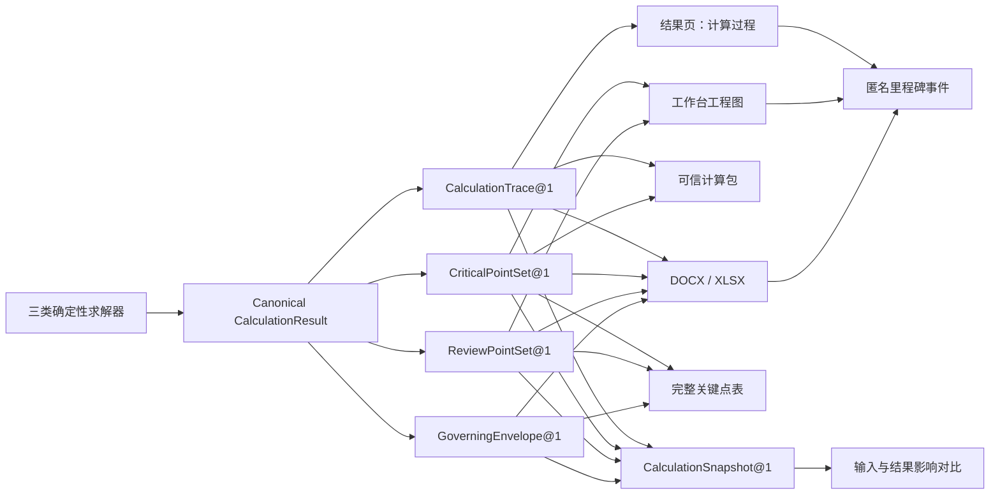

# ArchSight Solver v1.8.0 产品与架构计划

> 状态：已完成价值门槛评审，进入候选实施规划；本文不代表功能已完成、版本已发布或线上已部署。
> 规划日期：2026-08-13
> 当前基线：`v1.7.0`
> 版本主题：**从给出答案，到证明答案并比较迭代**

## 1. 决策摘要

v1.8.0 应继续做，但不能重复已并入 v1.7.0 的可信计算包、开放分发和三类学习复核路径。新的完整用户闭环应当是：

> 打开示例或模型 → 完成求解 → 审查计算过程 → 定位控制工况与复核位置 → 对比一次计算迭代 → 导出真正有差异的审查材料 → 携带同源证据复核。

版本只承诺五项核心价值：

1. 梁系、平面框架和平面桁架共享一条可追踪的计算过程证据链。
2. 系统关键点与用户复核点连接精确结果、工况/组合包络和控制来源。
3. 命名计算快照能解释一次模型修改前后控制值、控制位置和控制来源的变化。
4. 标准/详细及失败审查材料与屏幕、XLSX、可信计算包共享同一事实源。
5. 稳定分析作为新增求解层进入 v1.8.0：二维框架真实 P-Delta 与线性屈曲特征值共享审查底座，Gate A / Gate B 均为最终发布阻断门禁，必须分别通过且不得互相替代；求解、工作台、分层计算书与可信计算包链路已经接通，后续仍按发布验收清单完成整体验收。

可访问性、匿名产品事件、兼容回归和制品验证只作为上述价值的发布使能条件，不再额外拆分为独立产品主线。

首要用户是需要快速审查模型、结果和交付物的结构工程用户；教师与进阶学习者是同一证据链的第二类受益者。版本继续保持 Apache-2.0 开源、免费和二维、材料线弹性、静力边界；框架可选几何二阶与线性特征屈曲门禁，梁系与桁架仍按材料线弹性静力求解。

### 1.1 方案取舍

| 方向 | 决策 | 核心理由 |
|---|---|---|
| 计算过程与工程关键点 | **Expand** | 直接补齐从结果到复核交付的用户闭环，并复用现有求解、benchmark、导出和可信计算包资产 |
| 复核点、工况/组合包络与控制来源 | **Expand** | 回答“哪里控制、哪个工况控制”，把已有多工况结果从切换浏览提升为工程决策证据 |
| 命名计算快照与影响对比 | **Expand（有界）** | 回答“这次修改改变了什么”；只做本地、随项目携带的审查快照，不建设云版本平台 |
| 失败审查材料 | **Expand** | 不可解或被阻断模型同样需要可交接的诊断、已完成阶段和修复依据 |
| 真正 P-Delta 与特征屈曲 | **Expand（纳入 v1.8.0 最终发布门禁）** | 核心价值高且当前近似容易被误解，但它需要与 v1.8 的审查契约共用证据底座；当前代码已具备真实数值求解，Gate A / Gate B 均为最终发布阻断门禁且不得互相替代 |
| 新增结构分析域 | **Hold** | 当前数据不能证明用户因对象不足离开；扩域会稀释三类核心对象的专业可信度 |
| 继续增加学习路径/分发形态 | **Stop 重复建设** | 这些能力已在 v1.7.0 形成完整里程碑 |
| 仅做图上零点标签补丁 | **Reject** | 会继续让工作台、报告图、表格和计算包分别推导，无法保证同源 |
| 生成式 AI 自动解释计算 | **Reject** | 不能成为确定性数值证据；现阶段只允许解释已验证事实 |
| 先做页面增长或 A/B | **Hold** | 样本小且埋点窗口短，先建立价值漏斗和工程闭环更可信 |

### 1.2 当前成熟度判断

以下为基于仓库与截图的内部评审，不是外部市场认证：

| 维度 | 判断 | 证据/缺口 |
|---|---|---|
| 产品定位 | 高 | 三类结构与非目标清晰；下一版本价值曾因同日拆分被纠偏 |
| 数值与工程底座 | 高 | 66 个公开 benchmark、canonical result、独立复算与诊断基础已在 |
| 结果工作流 | 中高 | 求解、图形、导出闭环已在；过程审查和跨载体点表未贯通 |
| 交付与开放分发 | 高 | DOCX/XLSX/可信计算包、wheel、Host Client、容器均已形成正式资产 |
| 计算证据表达 | 中 | 有输入、假定、校核和哈希；缺 DOF、装配、约束、残差、恢复轨迹 |
| 工况决策 | 中 | 已能切换工况/组合；梁和桁架只有摘要包络，框架无统一包络，三类均缺控制来源与并列比较 |
| 迭代复核 | 中低 | 有撤销/重做、修订号和结果失效判断；缺可命名、可携带、可对比的计算快照 |
| 产品可观测性 | 中低 | 已有高价值终态事件；缺入口、阻断、结果呈现和过程检查事件 |
| 外部需求证据 | 低 | 当前只有数十访客且埋点时间短，不能从跳出率推出需求原因 |

## 2. Umami 数据判断

### 2.1 截图中的事实

| 窗口 | 访客 | 访问 | 浏览 | 跳出率 | 平均访问时长 |
|---|---:|---:|---:|---:|---:|
| 最近 7 天 | 56 | 75 | 107 | 79% | 2m08s |
| 最近 24 小时 | 13 | 15 | 15 | 100% | 0s |

近 7 天约为 `1.43` 次浏览/访问、`1.34` 次访问/访客；近 24 小时为 `1.00` 次浏览/访问。截图前 3 天没有流量柱，而匿名产品分析在 2026-08-09 才随 v1.7.0 上线，因此“增长 100%”主要反映从无数据到有数据，不能解释为用户增长。

[Umami 指标定义](https://docs.umami.is/docs/metric-definitions)将只有一个事件的访问定义为跳出，访问时长依赖一次访问中可比较的后续记录。Solver 又是单页工作台，因此 `100%` 跳出和 `0s` 不能直接解释为用户立即离开；它们只能说明 Overview 没有看见第二个可计记录。截图也不是 Events 明细，不能据此断言用户是否点击过求解、查看过结果或完成过导出。

### 2.2 可作出的产品判断

- **可以确认**：流量仍小，页面指标不足以支持扩分析域、做增长实验或给出统计显著性结论。
- **可以确认**：现有事件已覆盖求解、敏感性分析、导出、项目打开/保存和学习路径终态，但缺少入口选择、校验阻断、结果真正呈现、计算过程查看和工程关键点检查。
- **不能确认**：高跳出由结果解释不足、性能、流量来源或误访问中的哪一项造成。
- **应立即做**：在 Umami Events / Funnel 中建立事件漏斗，并做一次真实 tracker 网络冒烟；页面 Overview 只保留为发现信号。

v1.8.0 的主漏斗定义为：

`visit → workbench_ready → calculation_requested → calculation_completed → results_viewed → calculation_trace_viewed → export_completed`

该顺序可直接使用 [Umami Funnel](https://docs.umami.is/docs/funnel) 的 URL/事件步骤和窗口进行配置。

必须同时观察三个分支：

- `entry_path × analysis_mode`：用户从默认模型、公开案例、快速模板、项目文件还是 Host 进入；
- `calculation_requested → calculation_blocked / calculation_failed / calculation_completed`：区分输入问题、网络问题和求解问题；
- `results_viewed → calculation_trace_viewed → export_completed`：验证可审查过程是否真正进入交付闭环。

事件只发送固定枚举，不发送模型、荷载或结果数值、文件名、错误正文和身份信息。低流量阶段以原始会话数和漏斗掉点为主；至少积累 30 天或 100 次合格访问后，再考虑相对转化目标或 A/B 实验。

## 3. 当前能力与关键缺口

### 3.1 不重复建设的 v1.7.0 能力

- 工作台、REST、CLI 与 MCP 已使用同一种可信计算包。
- wheel、源码包、Host Client、容器和离线镜像已形成开放分发。
- 梁系、平面框架和平面桁架已有三条五分钟学习复核路径。
- 公开验证集已有 66 个通过算例，求解正确性和可独立复算已有基础证据。

原同日 v1.8.0 已撤下并完整并入 v1.7.0；本计划不会把上述内容重新命名为新版本价值。

### 3.2 计算书缺口

UI 在 `shared/report-options.json` 提供 `standard`（标准计算书）和 `complete`（详细计算书），`backend/exporters/common/report_options.py` 也会归一化 `reportOptions.template`，但三个 DOCX 导出器和三个 XLSX 导出器均未依据模板分支渲染。当前选择“详细计算书”不会形成可验证的内容结构差异，这是 P0 产品承诺缺口。以同一简单梁模型实测，两份 DOCX 除导出时间外均为 46 个段落、13 个表格和 4 张图，内容一致；两份 XLSX 也都是 7 个同名工作表且单元格值一致。

现有 `backend/exporters/common/evidence.py` 中的“计算方法说明”对三类结构分别只有 5 条通用文字步骤；`backend/tests/test_report_v2.py` 只确认章节和表格存在，没有验证自由度、矩阵装配、边界处理、残差和内力恢复等数值证据。`backend/verification_package.py` 保存输入、规范化模型、结果、诊断和哈希，但还没有独立的计算过程投影。

### 3.3 图形关键点缺口

用户口语中的“拐点”应拆成准确的工程语义，不能把所有点都叫拐点或反弯点：

- **梁系**：`frontend/src/lib/beam-diagram-key-points.ts` 当前识别全局极值、局部极值、剪力跳变肩点和部分端点，但弯矩最多 5 点、剪力最多 6 点、挠度最多 3 点，并受显示阈值过滤；没有弯矩零点/反弯点契约，也没有“完整检测、按需显示”的分层。
- **平面框架**：`frontend/src/lib/frame-member-diagrams.ts` 当前每种构件图只返回全结构一个绝对控制极值，未完整覆盖逐构件端值、局部极值、零点和荷载不连续点。
- **平面桁架**：轴力图已逐杆标值，位移图只标最大位移节点；理想二力杆没有梁式曲线拐点，不能误套弯矩、剪力语义。
- **数据曲线**：通用梁曲线只提供 hover 数值，没有常驻工程关键点标注。
- **跨载体一致性**：工作台默认关闭极值标签，导出时却强制开启；屏幕与报告还没有共享完整的关键点集合。

“全部关键点可复核”不等于“把全部标签永久挤在图上”。v1.8.0 要求完整检测和完整表格；默认图面只渲染经过优先级与避碰后的子集，并允许用户查看全部或点选精确值。

### 3.4 Roadmap 长期欠账的真实状态

- 梁系已经在 API/求解/导出层支持 `queryPointsM` / `queryPointRatios` 与 `queryResults`，但工作台没有把它提升为可管理的用户复核点，框架和桁架也没有统一契约。
- 三类结构已经支持荷载工况与组合并可切换结果；梁和桁架只有不带控制来源的摘要包络，平面框架没有同等级包络。当前用户能看不同来源，却不能稳定回答每个对象、指标和关键位置“由谁控制”。
- 撤销/重做、项目修订号、结果 provenance 和失效提示已在，但它们不是可命名的计算快照，也不能生成输入差异与结果影响对比。
- 平面桁架杆件均匀温差、内铰/端释放、支座位移、敏感性分析和本地异步作业已经实现；Roadmap 不再把它们列为未来版本价值。
- `pDelta` / `buckling` 已具备真实 P-Delta 与整体特征屈曲 backend；Gate A / Gate B 仍是 v1.8 的最终发布门禁，未通过前不得发布。

## 4. 产品方案

### 4.1 结果页增加“计算过程”

结果页新增只读的“计算过程”入口，按下列顺序渐进展开：

1. 输入规范化、单位换算和符号约定；
2. 节点、单元与自由度映射；
3. 单元刚度、坐标变换和等效节点荷载摘要；
4. 整体方程装配、边界条件和约化方程摘要；
5. 求解器后端、方程规模、稀疏性和残差；
6. 位移、反力和单元内力恢复；
7. 控制截面、控制构件和工程关键点的提取依据；
8. 整体平衡、benchmark 或独立复核证据。

计算过程展示结构化数值与来源，不由 AI 生成结论。说明性文字只能解释已存在的确定性证据。

### 4.2 标准计算书与详细计算书

| 内容 | 标准计算书 | 详细计算书 |
|---|---|---|
| 项目、输入、假定、单位和符号 | 包含 | 包含 |
| 控制结果、平衡校核、工程图和关键点表 | 包含 | 包含 |
| 节点/单元/自由度映射 | 摘要 | 完整表 |
| 单元刚度、变换和等效荷载 | 方法摘要 | 逐单元摘要与代表性数值 |
| 整体装配、约束与约化方程 | 规模和方法 | 可审查过程与代表性方程 |
| 求解诊断、残差与结果恢复 | 控制结论 | 完整证据链 |
| 可携带机器证据 | 哈希与包入口 | 版本化计算轨迹及完整关键点 |

默认不在 DOCX 中倾倒任意规模的完整全局矩阵。小模型可展示有上限的代表性矩阵；大模型展示维度、非零元、摘要、哈希和可下载机器轨迹，避免报告失控或浏览器冻结。

### 4.3 统一工程关键点

三类结构的适用关键点如下：

| 结构/指标 | 必须检测的工程关键点 |
|---|---|
| 梁弯矩 | 构件/跨端、支座、集中力矩或分段边界左右值、局部/全局极值、零点；零弯矩点在力学意义成立时标注为反弯点 |
| 梁剪力 | 构件/跨端、集中力和支座处左右值、局部/全局极值、连续段零点 |
| 梁挠度 | 构件/跨端、支座、局部/全局位移极值和控制挠度位置 |
| 框架轴力/剪力/弯矩/挠度 | 每根构件端值、荷载不连续点左右值、局部/全局极值、适用的零点，并带构件号和局部坐标 |
| 桁架 | 每根杆件轴力、支座/加载节点、最大位移节点和选中节点精确位移 |

关键点值应由求解段函数或受控高密度结果得到。不能用跨越重复测站或不连续点的简单线性插值伪造零点；不连续点必须保留 `left` / `right` 两侧值。检测容差、符号约定和显示精度均进入共享契约。

### 4.4 用户复核点、包络与控制来源

- 用户可在梁全局坐标、框架构件局部测站、桁架节点/杆件上创建命名复核点；节点、支座和构件端等离散位置直接引用对象结果。
- 每个复核点和系统关键点可查看主结果、各工况、各组合、正包络、负包络与绝对包络；包络点必须携带 `governingSource`，不能只返回一个无来源最大值。
- 梁和框架的包络沿可证明连续的分段/测站生成；桁架按节点与杆件离散对象生成。正负极值、绝对极值和控制来源不得混为一个字段。
- 结果页提供来源并列比较和“仅看控制项”，计算书与 XLSX 输出控制对象、位置、数值、单位、来源 ID、组合系数与符号约定。

### 4.5 命名计算快照与影响对比

- 用户在有效求解完成后可保存有界的命名计算快照；快照包含模型/请求/结果哈希、结果来源、轨迹摘要、关键点/复核点和控制来源，不复制可变运行时对象。
- 对比范围限定为同一分析对象的两个兼容快照：输入对象增删改、控制值变化、控制位置迁移、控制工况/组合变化、诊断状态变化。
- 数值差异必须同时显示绝对值、相对值、单位和不可比原因；零基值、对象删除、分析类型变化或契约不兼容时不伪造百分比。
- 快照随 `.slv` 或可信计算包有界携带，并有数量/体积上限；本版不做账号、远程历史、多人协作或无限版本库。

### 4.6 失败审查材料

校验阻断、矩阵奇异、不收敛或导出前置条件失败时，用户可导出只读失败审查材料，包含输入/项目标识、已完成过程阶段、稳定错误码、对象定位、诊断证据、模型/请求哈希和建议动作。失败材料不得包含伪造的位移、反力、内力、关键点、包络或“计算完成”结论。

## 5. 目标架构

### 5.1 `CalculationTrace@1`

`CalculationTrace` 是由计算应用层在求解完成时生成的只读、版本化投影，不是第二套求解器，也不由 DOCX、XLSX 或前端重新计算。建议包含：

- `schema`、`analysisType`、`requestHash`、`modelHash`、`resultHash`；
- 输入规范化和单位换算摘要；
- 节点/单元/自由度映射与约束状态；
- 单元刚度、坐标变换、等效荷载的有界摘要；
- 整体/自由方程规模、求解后端、非零元和残差；
- 位移、反力、内力恢复步骤及来源路径；
- 平衡校核、benchmark 证据和诊断；
- 截断策略与被省略数据的机器附件引用。

梁、框架和桁架可保留各自的 `details`，但共享阶段、来源、单位、精度和版本字段。投影只读取现有求解工件；首次落地不得改变刚度矩阵、荷载组装或线性方程求解算法。

### 5.2 `CriticalPointSet@1`

`CriticalPointSet` 将“发现关键点”和“画出标签”彻底分离。单个点至少包含：

- `analysisType`、`metric`、`objectId`；
- `station` / `stationRatio`、`value`、`unit`；
- `kind`：端点、支座、跳变、局部极值、全局极值、零点、控制点等；
- `side`：`left`、`right` 或 `exact`；
- `sourcePath`、`tolerance`、`priority` 和符号约定。

后端或共享领域层输出完整集合；工作台与报告图形只做确定性的优先级、避碰和密度控制。因空间隐藏的点仍必须出现在关键点表和点选详情中。

### 5.3 兼容与边界

- `solver-calculation-result@1` 和 `archsight-solver-verification-package@1.0.0` 的既有读取保持兼容；新字段先以可选扩展进入，再通过明确版本迁移升级。
- 标准版报告不要求完整矩阵；详细版的机器轨迹必须有尺寸、数量和序列化上限。
- 不上传计算轨迹或关键点数值到 Umami。
- 不让前端、导出器或 AI 解释层直接读取求解器可变内部对象并自行推导结果。

### 5.4 `ReviewPointSet@1`、`GoverningEnvelope@1` 与 `CalculationSnapshot@1`

- `ReviewPointSet` 统一用户指定位置与离散对象查询，复用 `CriticalPointSet` 的对象、测站、左右侧、单位、容差和来源语义。
- `GoverningEnvelope` 保存每个适用对象/测站/指标的正、负和绝对控制值及 `sourceType`、`sourceId`、组合系数、来源结果哈希；前端不再从摘要最大值反推控制工况。
- `CalculationSnapshot` 是 canonical result 的有界只读投影，包含契约版本、时间、名称、哈希、结果来源、轨迹/点集/包络引用和诊断摘要；快照对比由共享领域服务生成稳定差异，不由 React 组件临时 diff。
- 三个新契约先作为 calculation result 和项目文档的可选扩展，旧 `.slv`、API 消费者与可信计算包保持可读。

## 6. 实施分解

### Phase 0：先锁定承诺与失败证据（P0）

- 新增回归测试，证明当前 `standard` / `complete` 内容没有差异，并把“详细版必须多出计算轨迹章节和表格”写成目标断言。
- 定义 `CalculationTrace@1`、`CriticalPointSet@1`、容差、符号和大模型截断策略。
- 定义 `ReviewPointSet@1`、`GoverningEnvelope@1`、`CalculationSnapshot@1` 及包络控制来源、快照兼容/体积策略。
- 为梁、框架、桁架各选至少两个解析或 benchmark 模型，固定全过程与关键点期望值。
- 在 Umami Events 中核验现有事件是否真实入库，建立 v1.7.0 基线漏斗。

### Phase 1：建立同源事实层（P0）

- 在 `backend/application/` 和 `backend/contracts/` 增加计算轨迹投影；只读接入现有梁、框架、桁架求解工件。
- 在共享领域层生成完整关键点集合；优先处理重复测站、跳变两侧值、零点容差和构件局部坐标。
- 将轨迹、关键点、复核点、包络控制来源与快照投影以可选字段接入 canonical result、项目文档和可信计算包，保持旧工程兼容。

### Phase 2：完成审查型结果页与真实模板（P0）

- 增加“计算过程”和“工程关键点”结果视图，支持逐层展开、点表联动与来源定位。
- 让 `reportOptions.template` 真正控制 DOCX/XLSX 章节；标准版保持简洁，详细版渲染完整轨迹。
- 失败状态显示同构的诊断阶段与阻断位置，不伪造未完成的计算过程。
- 增加复核点管理、工况/组合并列比较、正负/绝对包络和控制来源定位。
- 增加命名计算快照与两快照影响对比；只允许兼容对象比较，并明确不可比原因。
- 增加失败审查材料导出，不要求先获得成功结果。

### Phase 3：统一图形标注（P1）

- 梁：完整检测端点、极值、跳变两侧值和适用零点。
- 框架：从单个全局极值升级到逐构件完整关键点。
- 桁架：保持逐杆轴力，补齐支座/加载节点和可点选位移，不引入梁式指标。
- 工作台、报告 SVG 和数据曲线共用同一集合；默认标注采用确定性避碰，完整表不裁剪。

### Phase 4：交付、观测与发布门禁（P1）

- DOCX、XLSX、可信计算包与屏幕视图做同值交叉断言。
- Playwright 覆盖三类结构、拥挤标签、三浏览器 DOCX 和真实下载。
- 补齐低敏感里程碑事件及其顺序测试；staging Umami property 完成真实网络冒烟。
- 完成候选观察、独立复核和 [v1.8.0 发布验收](verification/release-1-8-acceptance.md) 后，才允许单独决定 Tag、Release、镜像和线上更新。

## 7. 文件落点与测试落点

| 责任 | 首选落点 | 关键验证 |
|---|---|---|
| 计算轨迹契约 | `backend/contracts/`、`backend/application/` | `backend/tests/test_calculation_trace_contract.py` |
| 求解工件只读投影 | `backend/solver/beam/`、`backend/solver/frame/`、`backend/solver/truss/` 的边界适配 | 既有 benchmark、独立刚度法、轨迹数值断言 |
| 关键点契约 | 后端/共享领域模块与 `frontend/src/lib/` 类型镜像 | `backend/tests/test_result_critical_points.py`、`frontend/src/lib/result-critical-points.test.ts` |
| 复核点与控制包络 | `backend/contracts/`、`backend/application/`、前端结果模型 | `backend/tests/test_review_points_and_governing_envelope.py`、`frontend/src/lib/governing-envelope.test.ts` |
| 计算快照与差异 | 项目文档契约、`backend/application/`、`frontend/src/lib/` | `backend/tests/test_calculation_snapshot_diff.py`、`frontend/src/lib/calculation-snapshot.test.ts` |
| 结果页 | `frontend/src/components/WorkbenchResultContent.tsx` 及独立过程组件 | `frontend/tests/visual/release-1-8-calculation-trace.spec.ts` |
| 图形消费 | `BeamResultDiagrams.tsx`、`FrameMemberDiagrams.tsx`、`TrussResultDiagrams.tsx`、报告图形模块 | 单测、SVG DOM 断言、拥挤场景截图 |
| 报告模板 | `backend/exporters/`、`shared/report-options.json` | 标准/详细差异测试、DOCX/XLSX 内容测试 |
| 失败审查材料 | 诊断契约、`backend/exporters/`、导出 API | 阻断/奇异/不收敛场景，不出现伪造成功结果 |
| 可信计算包 | `backend/verification_package.py` | 旧包兼容、重放一致、哈希稳定性 |
| 产品事件 | `frontend/src/analytics/` 与各里程碑组件 | 事件顺序单测、Playwright 假 tracker、staging 网络冒烟 |

### 7.1 实施依赖与并行车道

契约和 benchmark 必须先行，之后才允许 UI、导出与持久化并行实现：

1. **串行前置**：冻结 canonical result 扩展、对象/测站/左右侧语义、容差、单位、来源哈希、失败状态和大模型有界策略；为三类结构建立解析/独立复算基线。
2. **车道 A——过程证据**：`CalculationTrace`、失败阶段与标准/详细报告分层。
3. **车道 B——结果决策**：`CriticalPointSet`、`ReviewPointSet`、`GoverningEnvelope` 与图表/点表消费。
4. **车道 C——迭代复核**：`CalculationSnapshot`、项目文件兼容和影响差异服务；只依赖已冻结的点集/包络引用。
5. **串行收口**：屏幕、DOCX、XLSX、可信计算包交叉断言，浏览器矩阵、旧项目/旧包兼容、Umami staging 冒烟和独立复核。

任何车道若需要从前端或导出器重新求解，或绕过 canonical result 临时拼接来源，必须停止并修复共享事实层后再继续。

## 8. 发布验收指标

### 8.1 工程硬门槛

- 选定 benchmark 的轨迹输入、自由度、方程规模、结果恢复、残差与最终结果 100% 对齐。
- `standard` 与 `complete` 的章节、表格和机器证据存在可断言差异，且二者最终数值完全一致。
- 所有适用关键点都进入完整点表；默认隐藏只允许由显示策略决定，不能在检测阶段静默丢弃。
- 屏幕、DOCX、XLSX 和可信计算包的关键点对象、测站、数值、单位和左右侧语义一致。
- 三类结构的适用复核点可精确查询；每个包络控制值携带可回放的工况/组合来源，屏幕与导出同值。
- 两个兼容计算快照可解释输入、控制值、位置、来源和诊断变化；不兼容或零基值场景不输出误导百分比。
- 被阻断或失败的计算可导出诊断材料，且不含任何伪造的成功结果或后续过程。
- 既有 66 个 benchmark、独立刚度法、前后端测试、构建、三浏览器 DOCX 和发布门禁全部通过。
- 旧 `.slv`、旧 API 消费者和 `verification-package@1.0.0` 不退化。

### 8.2 产品观察指标

- 主指标：`calculation_completed / calculation_requested`。
- 价值指标：`calculation_trace_viewed / calculation_completed`。
- 决策指标：`governing_source_inspected / results_viewed`、`snapshot_compared / calculation_completed`。
- 交付指标：`export_completed / calculation_completed`，按 `report_template` 和格式拆分。
- 质量指标：`calculation_blocked`、`calculation_failed`、`export_failed` 的阶段分布。
- 留存指标：完成过求解的匿名会话 7 日回访，不以所有页面访客作为分母。

当前样本不足，不预设虚假的绝对提升百分比。发布后按 v1.7 基线做 30 天同口径比较；指标下降时先检查埋点、流量来源和性能，再决定产品归因。

## 9. 主要风险与停止条件

| 风险 | 预防/停止条件 |
|---|---|
| 导出器或前端重新计算导致结果漂移 | 发现第二套求解逻辑即停止该实现，回到 canonical result 投影 |
| 稀疏采样线性插值制造假零点 | 无法证明连续段和容差时只显示区间，不输出精确反弯点 |
| “全部标值”令图面不可读 | 完整点表必须保留，图面使用优先级、避碰、缩放和点选详情 |
| 详细计算书体积或延迟失控 | 触发矩阵/单元上限时改为摘要、哈希和机器附件，不截断且不说明 |
| 轨迹暴露内部实现但不能稳定兼容 | 只发布版本化、不可变的投影契约，不暴露可变求解对象 |
| 包络只存最终极值，丢失控制来源 | 无法从 `sourceId` 和来源结果哈希回放时不得发布包络；正、负、绝对控制值分开存储 |
| 快照演化成无限历史或平台能力 | 强制同项目、同分析对象、数量/体积上限；账号、云同步和多人协作一律停止进入本版 |
| 失败材料暗示已得到结果 | 失败态只导出已完成阶段和诊断；发现伪造位移、内力、点值或“完成”结论即阻断发布 |
| 数据指标被误读为正确性 | 数值、图形与制品门禁继续独立；Umami 只验证旅程采用情况 |
| 范围被扩成设计平台或混入新求解域 | 规范承载力设计、账号/云协作和 AI 代替工程判断均停止进入本版；真实 P-Delta/特征屈曲属于 v1.8 最终发布门禁，Gate A / Gate B 必须分别通过且不得互相替代 |

## 10. 明确非目标

- 不新增第四类分析域，不做三维、动力或规范承载力设计；真实 P-Delta 与整体特征屈曲属于 v1.8 最终发布门禁，Gate A / Gate B 必须分别通过后才能发布。
- 不做账号、组织、课程、作业、云项目或多租户平台。
- 不重复建设 v1.7.0 已完成的学习路径、分发和可信计算包基础能力。
- 不用生成式 AI 生成或修正确定性数值过程。
- 不以浏览量、停留时长或外部试用人数替代求解正确性和发布证据。

## 11. 外部参照的正确用法

[SkyCiv Beam 的结果说明](https://skyciv.com/docs/skyciv-beam/interpreting-results/)把支座反力、内力图、force extrema、points of interest 和分段方程放在同一结果工作流中；其[手算过程](https://skyciv.com/docs/skyciv-beam/hand-calculations/)展示反力、剪力和弯矩的逐步计算，[导出说明](https://skyciv.com/docs/skyciv-beam/exporting-your-results-output/)又区分完整 PDF、单页摘要和全部测站 CSV。这证明“过程 + 关键点 + 分层报告”是成熟的用户价值，不是装饰功能。

[Dlubal RFEM 的结果图工作流](https://www.dlubal.com/en/downloads-and-information/documents/online-manuals/rfem-6/000484)把任意位置读数、端点/极值点表和包络放在同一结果环境中；[SkyCiv 的荷载组合说明](https://skyciv.com/docs/structural-3d/applying-loads/load-combinations/)明确区分 Min、Max、Abs Max 包络及组合比较。这支持 v1.8 将“位置—值—控制来源”建成同一证据链，而不是只增加图形标签。[SkyCiv 的 P-Delta 工作流](https://skyciv.com/docs/structural-3d/solving/non-linear-static-p-delta-analysis/)则显示二阶分析需要线性初算、迭代与收敛等完整语义，因此它进入 v1.8 的最终发布门禁并按 Gate A / Gate B 独立验收，而不是作为一个已完成的高级开关。

ArchSight Solver 不复制竞品的设计规范或云平台范围，而以开源、确定性、跨载体同源和可独立复算作为差异化。

本版首先实现跨三类结构稳定的数值证据契约；梁系可提供更细的分段推导，框架和桁架按其有限元过程展示可审查轨迹，不伪称每个任意模型都有简化手算公式。
